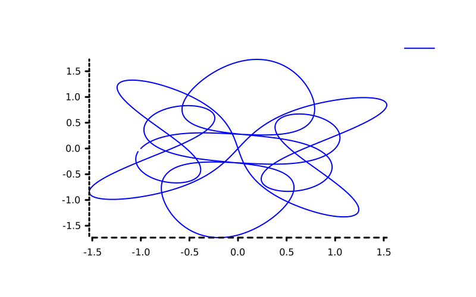
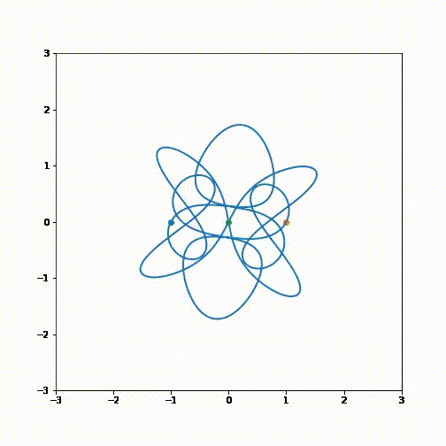

## Briefing

In physics and classical mechanics, the three-body problem is the problem of taking the initial positions and velocities (or momenta) of three point masses and solving for their subsequent motion according to Newton's laws of motion and Newton's law of universal gravitation.

  

## Example referente No2 from:
#### https://www.clas.kitasato-u.ac.jp/~fujiwara/nBody/SuvakovShibayama/SuvakovShibayamaChoreography.html

## Result
Since I couldn't find any lib to animate plots in rust, like matplotlib.animation in python, I just made a plot of the trajectory of 1°st body, but the gif below the image was made with the same code in python using matplotlib. 

